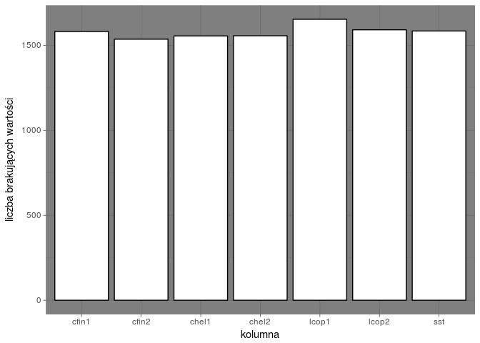
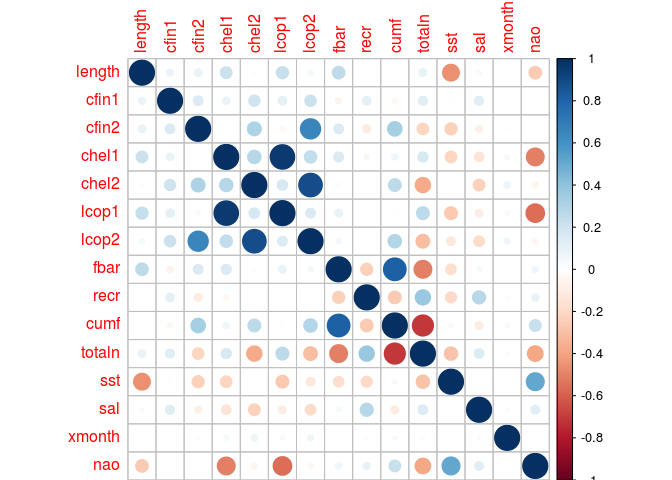

-   [1. Krótkie streszczenie](#krotkie-streszczenie)
-   [2. Ładowanie wykorzystywanych
    bibliotek](#adowanie-wykorzystywanych-bibliotek)
-   [3. Wczytanie danych](#wczytanie-danych)
-   [4. Zapewnienie powtarzalności
    wyników](#zapewnienie-powtarzalnosci-wynikow)
-   [5. Przetwarzanie brakujących
    danych](#przetwarzanie-brakujacych-danych)
-   [6. Krótkie podsumowanie danych po
    czyszczeniu](#krotkie-podsumowanie-danych-po-czyszczeniu)
-   [7. Zmiana wielkości ryby w czasie](#zmiana-wielkosci-ryby-w-czasie)
-   [8. Graficzna prezentacja korelacji pomiędzy
    danymi](#graficzna-prezentacja-korelacji-pomiedzy-danymi)
-   [9. Regresor przewidujący rozmiar
    śledzia](#regresor-przewidujacy-rozmiar-sledzia)
-   [10. Model](#model)
-   [11. Przewidywanie wartości i ocena
    błędu](#przewidywanie-wartosci-i-ocena-bedu)
-   [12. Analiza ważności atrybutów](#analiza-waznosci-atrybutow)
-   [13. Wnioski](#wnioski)

1. Krótkie streszczenie
-----------------------

Analiza dotyczy zbióru danych na temat połowu śledzia oceanicznego w
Europie. Do analizy zebrano pomiary śledzi i warunków w jakich żyją z
ostatnich 60 lat. Dane były pobierane z połowów komercyjnych jednostek.
W ramach połowu jednej jednostki losowo wybierano od 50 do 100 sztuk
trzyletnich śledzi. Dane stanowiły duże wyzwanie dla analityka. Ze
względu na fakt, iż były one posortowane chronologicznie, to atrybut Id
odpowiadał za czas, a nie xmonth. Przy przetwarzaniu danych i budowaniu
modelu należało zwrócić dodatkowo na fakt, iż wiele atrybutów posiadało
identyczne wartości dla różnych długości śledzia.

Poniżej znajdują się szczegółowe opisy konkretnych atrybutów:

<table>
<colgroup>
<col width="12%" />
<col width="50%" />
<col width="37%" />
</colgroup>
<thead>
<tr class="header">
<th>Dane</th>
<th>Opis</th>
<th>Dane</th>
</tr>
</thead>
<tbody>
<tr class="odd">
<td>length</td>
<td>długość śledzia</td>
<td>cm</td>
</tr>
<tr class="even">
<td>cfin1</td>
<td>dostępność planktonu</td>
<td>skupisko Calanus finmarchicus gat. 1</td>
</tr>
<tr class="odd">
<td>cfin2</td>
<td>dostępność planktonu</td>
<td>skupisko Calanus finmarchicus gat. 2</td>
</tr>
<tr class="even">
<td>chel1</td>
<td>dostępność planktonu</td>
<td>skupisko Calanus helgolandicus gat. 1</td>
</tr>
<tr class="odd">
<td>chel2</td>
<td>dostępność planktonu</td>
<td>skupisko Calanus helgolandicus gat. 2</td>
</tr>
<tr class="even">
<td>lcop1</td>
<td>dostępność planktonu</td>
<td>skupisko widłonogów gat. 1</td>
</tr>
<tr class="odd">
<td>lcop2</td>
<td>dostępność planktonu</td>
<td>skupisko widłonogów gat. 2</td>
</tr>
<tr class="even">
<td>fbar</td>
<td>intensywność połowów w regionie</td>
<td>ułamek pozostawionego narybku</td>
</tr>
<tr class="odd">
<td>recr</td>
<td>roczny narybek</td>
<td>liczba śledzi</td>
</tr>
<tr class="even">
<td>cumf</td>
<td>łączne roczne natężenie połowów w regionie</td>
<td>ułamek zachowanego narybku</td>
</tr>
<tr class="odd">
<td>totaln</td>
<td>łączna liczba ryb złowionych w ramach pojedynczego połowu</td>
<td>liczba śledzi</td>
</tr>
<tr class="even">
<td>sst</td>
<td>temperatura przy powierzchni wody</td>
<td>stopnie °C</td>
</tr>
<tr class="odd">
<td>sal</td>
<td>poziom zasolenia</td>
<td>liczba części na milion</td>
</tr>
<tr class="even">
<td>xmonth</td>
<td>miesiąc połowu</td>
<td>numer miesiąca</td>
</tr>
<tr class="odd">
<td>nao</td>
<td>oscylacja północnoatlantycka</td>
<td>mb</td>
</tr>
</tbody>
</table>

2. Ładowanie wykorzystywanych bibliotek
---------------------------------------

    library(knitr)
    library(plyr)
    library(dplyr)
    library(tidyr)
    library(ggplot2)
    library(plotly)
    library(corrplot)
    library(caret)
    library(zoo)

3. Wczytanie danych
-------------------

    fish_data <- read.csv(url("http://www.cs.put.poznan.pl/dbrzezinski/teaching/zed/sledzie.csv"),header = TRUE, sep = ",", comment.char = "", stringsAsFactors = TRUE, na.strings = "?", col.names = c("id", "length", "cfin1", "cfin2", "chel1", "chel2", "lcop1", "lcop2", "fbar", "recr", "cumf", "totaln", "sst", "sal", "xmonth", "nao"))

4. Zapewnienie powtarzalności wyników
-------------------------------------

Wywołanie funkcji "set.seed(25)" zapewnia powtarzalność wyników
dokonywanych operacji.

    set.seed(25)

5. Przetwarzanie brakujących danych
-----------------------------------

Poniższy wykres przedstawia liczbę wartości NA (brak wartości) dla
konkretnego zbioru danych (danej kolumny).

    liczba_na <- fish_data %>%
      gather("column", "value", 1:ncol(fish_data)) %>%
      filter(is.na(value))

    ggplot(liczba_na, aes(factor(column))) +
      geom_bar(fill="white", colour="black") +
      labs(x = "kolumna", y = "liczba brakujących wartości") + theme_dark()

Brakujące dane znajdują się w kolumnach:

-   cfin1 - dostępność planktonu - skupisko Calanus finmarchicus gat. 1
-   cfin2 - dostępność planktonu - skupisko Calanus finmarchicus gat. 2
-   chel1 - dostępność planktonu - skupisko Calanus helgolandicus gat. 1
-   chel2 - dostępność planktonu - skupisko Calanus helgolandicus gat. 2
-   lcop1 - dostępność planktonu - skupisko widłonogów gat. 1
-   lcop2 - dostępność planktonu - skupisko widłonogów gat. 2
-   sst - temperatura przy powierzchni wody stopnie °C

Z powodu silnego powiązania danych, zostały one zastąpione tymi samymi
danymi z obserwacji określonych przez numer miesiąca oraz liczbę
złowionych ryb (sumę złowionych ryb).

    zast_data <- function(x) replace(x, is.na(x), mean(x, na.rm = TRUE))
    data_re <- ddply(fish_data, .(totaln), transform, 
                           cfin1 = zast_data(cfin1),
                           cfin2 = zast_data(cfin2),
                           chel1 = zast_data(chel1),
                           chel2 = zast_data(chel2),
                           lcop1 = zast_data(lcop1),
                           lcop2 = zast_data(lcop2),
                           sst = zast_data(sst))

6. Krótkie podsumowanie danych po czyszczeniu
---------------------------------------------

    ##        id            length         cfin1             cfin2        
    ##  Min.   :    0   Min.   :19.0   Min.   : 0.0000   Min.   : 0.0000  
    ##  1st Qu.:13145   1st Qu.:24.0   1st Qu.: 0.0000   1st Qu.: 0.2778  
    ##  Median :26290   Median :25.5   Median : 0.1111   Median : 0.7012  
    ##  Mean   :26290   Mean   :25.3   Mean   : 0.4462   Mean   : 2.0258  
    ##  3rd Qu.:39436   3rd Qu.:26.5   3rd Qu.: 0.3333   3rd Qu.: 1.7936  
    ##  Max.   :52581   Max.   :32.5   Max.   :37.6667   Max.   :19.3958  
    ##      chel1            chel2            lcop1              lcop2       
    ##  Min.   : 0.000   Min.   : 5.238   Min.   :  0.3074   Min.   : 7.849  
    ##  1st Qu.: 2.469   1st Qu.:13.427   1st Qu.:  2.5479   1st Qu.:17.808  
    ##  Median : 5.750   Median :21.435   Median :  7.0717   Median :24.859  
    ##  Mean   :10.003   Mean   :21.219   Mean   : 12.8080   Mean   :28.422  
    ##  3rd Qu.:11.500   3rd Qu.:27.193   3rd Qu.: 21.2315   3rd Qu.:37.232  
    ##  Max.   :75.000   Max.   :57.706   Max.   :115.5833   Max.   :68.736  
    ##       fbar             recr              cumf             totaln       
    ##  Min.   :0.0680   Min.   : 140515   Min.   :0.06833   Min.   : 144137  
    ##  1st Qu.:0.2270   1st Qu.: 360061   1st Qu.:0.14809   1st Qu.: 306068  
    ##  Median :0.3320   Median : 421391   Median :0.23191   Median : 539558  
    ##  Mean   :0.3304   Mean   : 520366   Mean   :0.22981   Mean   : 514973  
    ##  3rd Qu.:0.4560   3rd Qu.: 724151   3rd Qu.:0.29803   3rd Qu.: 730351  
    ##  Max.   :0.8490   Max.   :1565890   Max.   :0.39801   Max.   :1015595  
    ##       sst             sal            xmonth            nao          
    ##  Min.   :12.77   Min.   :35.40   Min.   : 1.000   Min.   :-4.89000  
    ##  1st Qu.:13.60   1st Qu.:35.51   1st Qu.: 5.000   1st Qu.:-1.89000  
    ##  Median :13.86   Median :35.51   Median : 8.000   Median : 0.20000  
    ##  Mean   :13.87   Mean   :35.51   Mean   : 7.258   Mean   :-0.09236  
    ##  3rd Qu.:14.16   3rd Qu.:35.52   3rd Qu.: 9.000   3rd Qu.: 1.63000  
    ##  Max.   :14.73   Max.   :35.61   Max.   :12.000   Max.   : 5.08000

7. Zmiana wielkości ryby w czasie
---------------------------------

Poniższy wykres przedstawia zmianę długości śledzi wględem czasu.

<!--html_preserve-->

<!--/html_preserve-->
8. Graficzna prezentacja korelacji pomiędzy danymi
--------------------------------------------------

Największa korelacja dotyczy par lcop1 i chel1 oraz lcop2 i chel2, z
tego powodu dane zostały usunięte w dalszych etapach analizy.
Zoboserwoano również duży współczynnik korelacji pomiędzy cumf oraz
totaln - co naturalnie zmusza do postawienia wniosku, że wraz ze
wzrostem łącznej liczby ryb złowionych w ramach pojedynczego rownolegle
zwiększa się natężenie połowów. Dodatkowo można stwierdzić, że łączne
roczne natężenie połowów (cumf) było wysokie tak samo jak ich
intensywność (fbar).

    cor_dat <- cor(data_re %>% select(-id))
    corrplot(cor_dat, method="circle")

9. Regresor przewidujący rozmiar śledzia
----------------------------------------

Podział zbioru danych na zbiór treningowy i zbiór testowy. Dla zbioru
treningowego użyte zostały dane bez wartości NA, które zostały usunięte
ze względu na brak wpływu na wartość atrybutu "length". Dla zbioru
testowego zastosowano dane także bez tych atrybutów, które nie zostały
uwzględnione dla danych treningowych.

    clean_data <- select(data_re,-c(chel1,chel2,cumf))

    w_tren <-
      createDataPartition(
        y = clean_data$length,
        p = .80,
        list = FALSE)
    training <- clean_data[ w_tren,]
    testing  <- clean_data[-w_tren,]
    control <- trainControl(
      method = "repeatedcv",
      number = 3,
      repeats = 3)
    fish_done <- train(length ~ .,
                 data = training,
                 method = "rf",
                 trControl = control,
                 importance = TRUE,
                 ntree = 10
    )

10. Model
---------

    fish_done

    ## Random Forest 
    ## 
    ## 42067 samples
    ##    12 predictors
    ## 
    ## No pre-processing
    ## Resampling: Cross-Validated (3 fold, repeated 3 times) 
    ## Summary of sample sizes: 28044, 28046, 28044, 28046, 28043, 28045, ... 
    ## Resampling results across tuning parameters:
    ## 
    ##   mtry  RMSE      Rsquared 
    ##    2    1.134725  0.5283713
    ##    7    1.087922  0.5670916
    ##   12    1.182886  0.5115481
    ## 
    ## RMSE was used to select the optimal model using  the smallest value.
    ## The final value used for the model was mtry = 7.

11. Przewidywanie wartości i ocena błędu
----------------------------------------

Poniższe wyniki wskazują, że zbiór nie jest przetrenowany.

    testing <- na.omit(testing)
    przew <- predict(fish_done,testing)

    ## Loading required package: randomForest

    ## randomForest 4.6-12

    ## Type rfNews() to see new features/changes/bug fixes.

    ## 
    ## Attaching package: 'randomForest'

    ## The following object is masked from 'package:ggplot2':
    ## 
    ##     margin

    ## The following object is masked from 'package:dplyr':
    ## 
    ##     combine

    aktualne <- testing[,"length"]
    RMSE <- sqrt(mean((przew-aktualne)^2))
    RMSE

    ## [1] 1.085863

12. Analiza ważności atrybutów
------------------------------

    varImp(fish_done$finalModel)

    ##          Overall
    ## id     14.940561
    ## cfin1   5.424381
    ## cfin2   5.004971
    ## lcop1   7.429268
    ## lcop2   4.964534
    ## fbar    4.901743
    ## recr    2.895514
    ## totaln  4.454764
    ## sst     5.526494
    ## sal     2.169499
    ## xmonth 42.912946
    ## nao     6.594056

13. Wnioski
-----------

Według powyższej analizy, na długość śledzia najbardziej ma wpływ
atrybut xmonth. Można wysnuć wnioski, że ma to wpływ z występowaniem
planktonu o konkrentej porze roku.

------------------------------------------------------------------------

Moment, when laptop turns into heli because of Random Forest:

